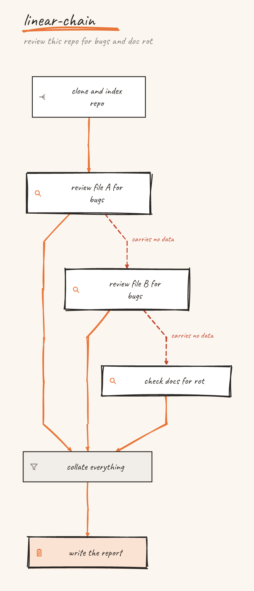
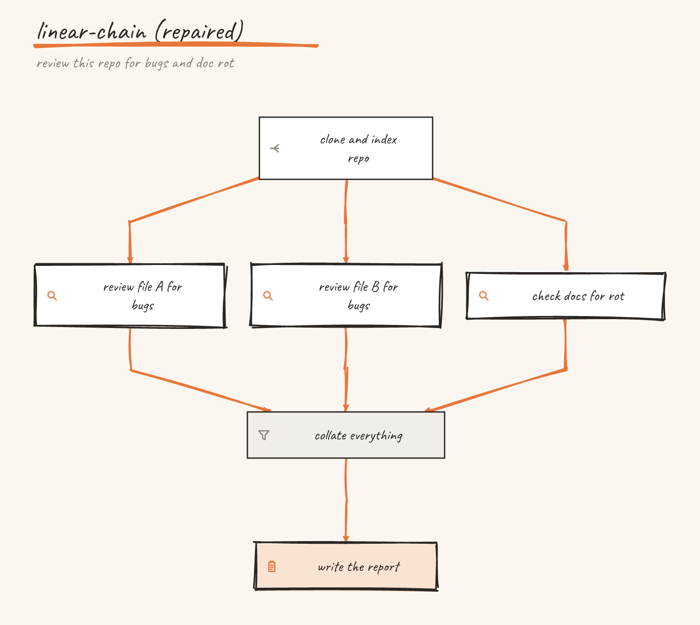
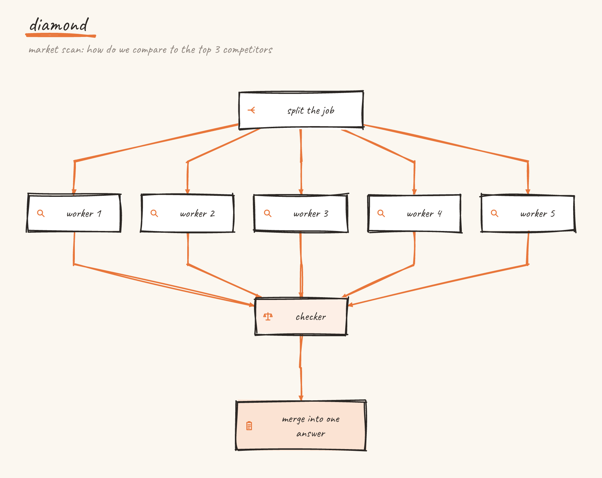
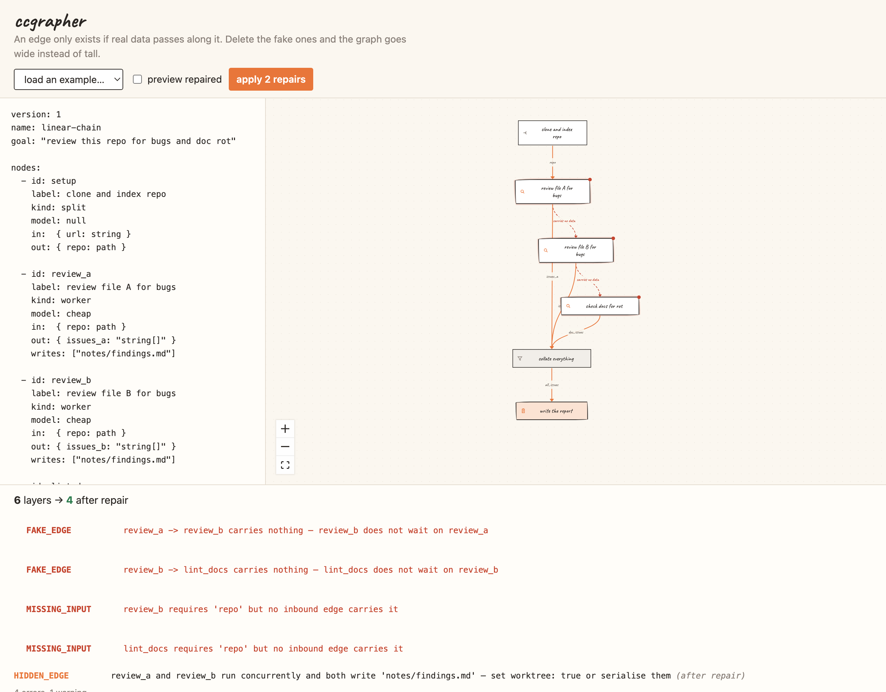
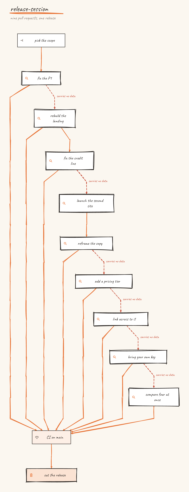
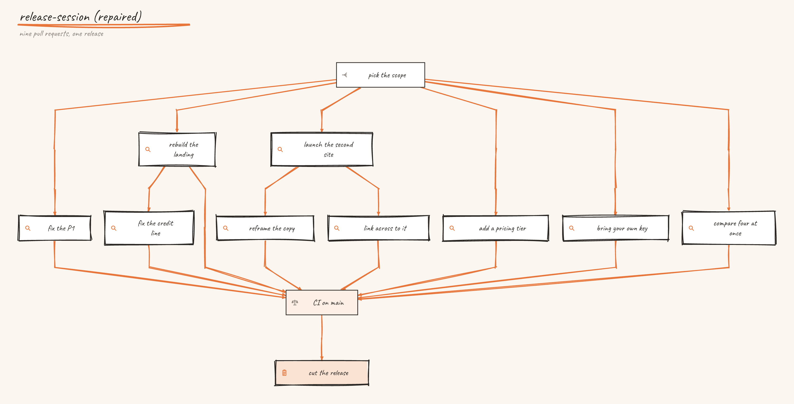

# ccgrapher

[](https://github.com/artfusion/ccgrapher/actions/workflows/ci.yml)
[](LICENSE)

**Your verification step is not checking what you think it is checking.** ccgrapher lints agent
workflows for the joins that pass while a branch lies dead and the verifiers grading their own
work. It also finds every step that was never waiting, and runs those together.

---

## Start here: the Claude Code skill

If you use Claude Code, this is the whole product in one command:

```bash
git clone https://github.com/artfusion/ccgrapher.git
ln -s "$PWD/ccgrapher/skills/parallel-plan" ~/.claude/skills/parallel-plan
```

Now, before your agent executes a plan of five steps or more, it checks which of them actually
depend on each other — and runs the independent ones concurrently instead of marching down the
list.

```
  wave 1               scope
  wave 2  ×6 together  fix_auth, rebuild_landing, new_site, pricing, byok, compare
  wave 3  ×3 together  add_tests, reframe_copy, cross_links
  wave 4               review
  wave 5               release
```

That's a real session: nine pull requests that were shipped one after another. Six of them were
never waiting on anything. Same work, five waves instead of twelve.

The speed is the bonus. The reason to run it is the failures it catches: a step that grades its
own work, or a fan-in that reports success when one branch silently died.

**Why it works:** you have to declare what each step *reads*, not what happened before it. Writing
that down honestly is what exposes the steps that were never waiting. Everything below is the
machinery that checks the claim.

---

## The idea

An edge between two agent nodes only exists if **real data passes along it**. Most workflows get
typed as a straight chain out of habit, because that's the order the steps occurred to you — so most
edges are fake. Delete them and the graph goes wide instead of tall: the same work now finishes in
the time of the slowest layer instead of the sum of every step.

Here is the same six-node workflow before and after. Nothing was rewritten; two edges that carried
no data were repointed to the node that actually supplies what the reviewers read.

| Written as a chain — 6 layers | What it actually is — 4 layers |
| --- | --- |
|  |  |

The three review steps never needed each other. The linter finds that mechanically, and the picture
is just how you see it.

## Quickstart

```bash
npx @ccgrapher/cli lint your-workflow.yaml
```

Nothing to install. Or from source:

```bash
git clone https://github.com/artfusion/ccgrapher.git
cd ccgrapher && pnpm install && pnpm build
node apps/cli/dist/index.js lint examples/linear-chain.yaml
```

```
linear-chain — review this repo for bugs and doc rot

  error  FAKE_EDGE      review_a -> review_b carries nothing — review_b does not wait on review_a
  error  FAKE_EDGE      review_b -> lint_docs carries nothing — lint_docs does not wait on review_b
  error  MISSING_INPUT  review_b requires 'repo' but no inbound edge carries it
  error  MISSING_INPUT  lint_docs requires 'repo' but no inbound edge carries it
   warn  HIDDEN_EDGE    review_a and review_b run concurrently and both write 'notes/findings.md'
                        — set worktree: true or serialise them (after repair)

  Proposed repairs
    repoint  review_a -> review_b becomes setup -> review_b, carrying 'repo'
      setup is the nearest node that supplies 'repo'
    repoint  review_b -> lint_docs becomes setup -> lint_docs, carrying 'repo'
      setup is the nearest node that supplies 'repo'

  Critical path: 6 layers -> 4 layers (2 fewer after repair)
  5 findings (4 errors, 1 warning)
```

Exit code is `0` when clean, `1` when there are errors, `2` on bad usage.

---

## Writing a spec

A spec is YAML. Two required lists — `nodes` and `edges` — plus a name and an optional goal.

```yaml
version: 1
name: market-scan
goal: "how do we compare to the top 3 competitors"   # a caption, never a node

nodes:
  - id: split
    label: split the job
    kind: split
    in:  { question: string }
    out: { angle: string }

  - id: worker_1
    label: worker 1
    kind: worker
    model: cheap
    in:  { angle: string }
    out: { claim: string, source: url }

edges:
  - { from: split, to: worker_1, carries: [angle] }
```

### Nodes

| Field | Type | Meaning |
| --- | --- | --- |
| `id` | string, **required** | Unique. Used in edges and in generated code. |
| `label` | string, **required** | What's drawn in the box. One to four words. |
| `kind` | enum, **required** | See below. Drives the shape and the icon. |
| `in` | map | Field name → type descriptor. What this node consumes. |
| `out` | map | Field name → type descriptor. What it produces. |
| `model` | `cheap` \| `strong` \| `null` | `null` means plain code — no model, no tokens. |
| `writes` | string[] | Files or APIs it touches. Two concurrent writers is a hidden edge. |
| `freshContext` | boolean | Set on a verifier. A worker must never grade its own work. |
| `expects` | number | Fan-in guard. How many results should arrive. |
| `fanOut` | `{ over, cap? }` | Run once per item. Stays one node, drawn as a stack badged `×N`. |
| `worktree` | boolean | Isolated space per run, so parallel workers can't collide on disk. |

**Kinds.** `split` fans work out · `worker` does a unit of it · `verifier` checks someone else's ·
`reduce` combines (usually plain code) · `synthesize` writes the final answer · `gate` is a human
approval · `goal` is available for an explicit goal node, though the top-level `goal:` string is a
caption and is never turned into one.

**Type descriptors** are free text — `string`, `url`, `path`, `markdown`, `boolean`, `string[]`,
`YYYY-MM-DD`, `keep|drop`. The linter only compares field *names*, but codegen turns descriptors
into real JSON Schema and TypeScript types, so being specific pays off.

### Edges

| Field | Meaning |
| --- | --- |
| `from`, `to` | Node ids. |
| `carries` | The field names that travel along this edge. **This is the whole game.** |

An edge is real when `carries` names fields that exist in the source's `out` **and** the target's
`in`. If nothing survives that intersection, the edge is a wait with nothing behind it — and that is
what `FAKE_EDGE` reports.

### Layers

You never declare layers. A node sits one row below its deepest dependency, so any two nodes with no
dependency between them land on the same row automatically. The diamond shape falls out of this:



---

## The six lint rules

| Rule | Severity | Fires when |
| --- | --- | --- |
| `FAKE_EDGE` | error | No carried field lands in the target's declared `in`. |
| `MISSING_INPUT` | error | A non-root node declares an input nothing supplies. |
| `HIDDEN_EDGE` | warn | Two concurrent nodes share a `writes` entry and neither is isolated. |
| `SELF_GRADING` | warn | A `verifier` is not marked `freshContext`. |
| `CONTEXT_COLLAPSE` | warn | More than 30 results arrive with no intermediate `reduce`. |
| `SILENT_FAILURE` | warn | A real fan-in has no `expects` guard, or the guard is wrong. |

Two things about this that aren't obvious:

**Lint runs twice.** Some problems are invisible in the graph as written. In `linear-chain` the two
reviewers both write `notes/findings.md`, but one is a rank behind the other, so they never look
concurrent. Only once the fake edges are repaired do they land on the same row and the collision
become real. Findings therefore carry `phase: "raw" | "repaired"`.

**Repairs repoint, they don't delete.** Deleting a fake edge leaves its target as a root that starts
before its real dependency has produced anything. So the proposal is always "repoint to the nearest
ancestor that supplies the missing field", and only when nothing upstream can supply it is the edge
dropped.

---

## Rendering

```bash
ccg render examples/diamond.yaml -o diagram.svg          # hand-drawn SVG
ccg render examples/diamond.yaml -o diagram.mmd          # Mermaid
ccg render examples/diamond.yaml -o diagram.excalidraw   # Excalidraw scene
ccg render examples/linear-chain.yaml --fix -o after.svg # draw the repaired graph
```

The format comes from the extension, or pass `-f svg|mermaid|excalidraw`.

- **SVG** — rough.js strokes, paper texture, the handwriting face embedded so the file renders
  identically anywhere. Fake edges are red and dashed with a "carries no data" label.
  `--no-grain` drops the paper texture (much smaller once rasterised); `--no-embed-font` references
  the typeface by name instead of inlining it.
- **Mermaid** — `flowchart TD` with `look: handDrawn`. Renders on GitHub and in Notion. Each kind
  gets a distinguishable shape, and edges are labelled with what they carry.
- **Excalidraw** — a scene you can open and nudge by hand. Arrows are bound to their boxes and
  labels live inside their containers, so dragging a node takes everything with it.

Every renderer is deterministic: same spec in, byte-identical output out.

## Generating orchestration code

```bash
ccg codegen examples/diamond.yaml -t claude-code   # agent() / parallel()
ccg codegen examples/diamond.yaml -t plain-ts      # typed functions + Promise.all
ccg codegen examples/diamond.yaml -t langgraph     # StateGraph wiring
```

Stages come straight from the graph's ranks, so the concurrency in the generated script is exactly
the concurrency the diagram shows — the two cannot drift.

```js
phase("Workers")
const [worker_1, worker_2, worker_3, worker_4, worker_5] = await parallel([
  () => agent(`worker 1. Return claim (string), source (url), date (YYYY-MM-DD).
…`, { label: "worker_1", schema: WORKER_1_SCHEMA, model: "haiku" }),
  …
])

phase("Checker")
const checkerInputs = [worker_1, worker_2, worker_3, worker_4, worker_5].filter(Boolean)
if (checkerInputs.length < 5) {
  log(`checker: expected at least 5 results, got ${checkerInputs.length}`)
}
// checker runs in a fresh context — it must not share one with the work it grades
const checker = await agent(…)
```

`fanOut` becomes a capped `parallel` map, `worktree` becomes `isolation: "worktree"`, and `expects`
becomes a guard on the results that *arrived* — because a dead upstream node otherwise slips through
and the synthesis step reports on partial data as though it were whole.

The generated guard is a floor rather than an equality: at run time a shortfall is the failure, and a
count that overshoots means the guard is stale rather than that anything is missing. `SILENT_FAILURE`
is the stricter of the two, and polices the exact count at spec time, where it can still be fixed.

Pass `--fix` to generate from the repaired graph. Generating from a spec with known fake edges bakes
the wasted waits into your runtime, so the CLI warns when you do.

## Reading existing code

The other direction — what does my workflow *actually* do, rather than what did I intend?

```bash
ccg ingest orchestration.ts            # reconstruct the spec
ccg ingest orchestration.ts --lint     # audit the code directly
```

`ingest` uses ts-morph to recover nodes, dependencies and concurrency from real TypeScript. This is
where the fake-edge audit finds waste that was never in anyone's diagram.

Round-tripping is lossless: `spec → codegen → ingest → spec` returns a deeply-equal spec for every
fixture, which the test suite asserts. Descriptors TypeScript would flatten to `string` (`url`,
`path`, `YYYY-MM-DD`) ride along in trailing comments, and everything the type system can't express
— kind, model tier, fresh context, worktree, guards — lives in the doc comment above each function.
Both read as ordinary documentation.

## Retrospective mode

History is a workflow too. `retro` rebuilds the graph of a repo's last N merged pull requests —
nobody writes a line of YAML:

```bash
ccg retro owner/repo --lint            # audit the as-merged history directly
ccg retro owner/repo -o history.yaml   # or keep the spec for render / plan
```

One node per PR, labelled with its ticket IDs, `writes:` filled from the changed files. The
merge-order chain is the claim under audit: an edge carries data only where there is *evidence* of
coupling — two PRs touched the same file. Everything the repair pass then drops had **no detectable
dependency**, which is a smaller claim than *independent*, and the one the data supports.

Rendered before and after, a fortnight of sequential merges usually collapses from a staircase to a
few short chains — the same picture `examples/release-session.yaml` draws by hand, recovered from
any repo automatically. Requires the [GitHub CLI](https://cli.github.com) (`gh`) and whatever access
to the repo your `gh auth` already has; `--from-json` replays a saved `gh pr list` dump instead, for
offline runs and tests.

## Running a spec

The spec is not only a picture. `ccg run` executes it, one rank at a time, and writes a trace of
what actually happened:

```bash
ccg run examples/live-demo.yaml --impl examples/live-demo.impl.mjs
```

`--impl` is an ordinary JS module. Every node id in the spec needs an exported function of the same
name, and a node that has none is an error **before the run starts**, naming all of them at once.
Finding that out halfway through is the kind of failure this project exists to prevent. Gates are
the exception: a gate is answered by a human, never executed, so it needs no implementation.

A node is handed a `NodeContext` and returns `{ output?, usage? }`, or nothing. `context.inputs`
holds only the results that genuinely arrived, never padded and never holed, so a node can always
tell what reached it. `context.log(line)` writes a `node_log` event against that node.

The trace lands in `runs/<run-id>.jsonl`, or wherever `--trace` says. The run id and the filename
are the same fact, which is what lets `ccg serve` stream a file and the fold key on it. A run never
appends to a trace that already exists: two runs in one file would number two sequences from zero,
and a trace is a record rather than something to write over.

```bash
ccg run spec.yaml --impl impl.mjs --serve         # a canvas can watch, and answer gates over HTTP
ccg run spec.yaml --impl impl.mjs --timeout 300   # give up on any one node after five minutes
```

**Gates.** With `--serve` the run embeds the trace server in its own process and a gate waits for a
`POST /runs/<id>/gates/<node>`. Without it, the run asks on the terminal. If neither is possible,
no terminal and no server, the run refuses to start rather than approving the gate for you. An
unattended gate that approves itself is exactly the lie the rest of this tool exists to find.

Exit codes are `0` for a run where everything completed, `1` for one that failed, `2` for bad usage
or an implementation that does not cover the spec, and `3` for a run stopped at a rejected gate.
The rejection has its own code because the engine already distinguishes it from a failure: a script
needs to be able to tell "the workflow broke" from "a human said no".

`examples/traces/live-demo.jsonl` is the trace the demo above produces, committed so the canvas has
a sample run to develop against. `ccg trace stats` summarises it; `ccg serve examples/traces`
replays it.

## The web canvas

```bash
pnpm --filter @ccgrapher/web dev
```



Edit the YAML and the graph redraws and re-lints on every keystroke. **preview repaired** shows the
collapsed graph without touching your source; **apply repairs** rewrites it. It imports the same
`core`, `lint` and `layout` packages the CLI does, so the two can't disagree.

---

## More on the skill

`skills/parallel-plan/` triggers on plans of roughly five steps or more, or whenever work is being
fanned out to subagents. Below that the ceremony costs more than it saves, and a skill that fires
on everything gets ignored. `template.yaml` is the starting point it copies.

Two things worth knowing when reading its output:

- **Waves are an upper bound, not an instruction.** Six steps in one wave means six *may* run at
  once — rate limits, cost, or a shared file may say otherwise.
- **The layer count is only as honest as the `in:` fields.** Declare a dependency that isn't real
  and you get a chain back. The spec is the argument; the tool checks it for consistency.

## Architecture

| Package | Does |
| --- | --- |
| [`core`](packages/core) | Zod schema, YAML parsing, cycle detection, longest-path ranks |
| [`lint`](packages/lint) | The six rules and the two-pass repair pipeline |
| [`layout`](packages/layout) | dagre wrapper → positioned nodes and routed edges |
| [`render-svg`](packages/render-svg) | rough.js + paper texture + embedded font |
| [`render-mermaid`](packages/render-mermaid) | `flowchart TD` with `look: handDrawn` |
| [`render-excalidraw`](packages/render-excalidraw) | Scene JSON with bound arrows |
| [`codegen`](packages/codegen) | Spec → Claude Code / plain TS / LangGraph |
| [`ingest`](packages/ingest) | ts-morph: orchestration code → spec |
| [`trace`](packages/trace) | The event contract, the JSONL writer, and the fold every reader shares |
| [`runner`](packages/runner) | Walks the ranks, enforces the guards, emits the trace |
| [`apps/cli`](apps/cli) | `ccg lint · render · codegen · ingest · run · serve` |
| [`apps/web`](apps/web) | Next.js + React Flow canvas |

**The one invariant.** `core` computes *ranks*; `layout` computes *pixels*. The "6 layers → 4" figure
in a lint report comes from `core` and never from the layout library, so the picture and the report
cannot silently disagree. dagre runs with `ranker: "longest-path"` to match, and a test asserts the
two agree on every fixture.

`core`'s main entry is bundler-safe; filesystem helpers live at `@ccgrapher/core/node`. That's what
lets the browser canvas run the identical linter.

## Development

```bash
pnpm build          # tsc -b across the workspace
pnpm test           # 246 tests
pnpm test:watch
```

Node 22+. CI runs the suite on Node 22 and 24 and re-checks the acceptance criteria end to end.

Generated code is verified by parsing it, not by eyeballing: the TypeScript targets go through real
`ts.createProgram` diagnostics under `strict`, and the Claude Code target is parsed as an async
function body. Mermaid output is verified by rendering it — open `tools/mermaid-check.html` after
emitting some `.mmd` files. `tools/rasterize.mjs` regenerates the README images.

See [CONTRIBUTING.md](CONTRIBUTING.md) — adding a lint rule is four steps and the most useful thing
you could contribute.

### Examples

`diamond`, `research-desk` and `route-auth-audit` are clean — every edge carries real data, so they
double as the negative controls in the test suite. `linear-chain` is deliberately broken and is the
linter's fixture. `self-grading` and `wide-fanin` were added because nothing in the original drop
exercised `SELF_GRADING` or `CONTEXT_COLLAPSE`. `live-demo` is the one that executes: it lints
clean, sleeps rather than calling a model, fails one node on purpose and stops at a human gate.

`release-session` is the one to read if you want to see why this is worth doing. It is not an agent
workflow at all — it is a week of human work: nine pull requests shipped one after another, then a
release. Six of the nine were never waiting on anything, and the CI node declares it expects nine
results while only eight edges reach it. A release that looks complete, built on a check that never
saw everything.

```bash
ccg lint examples/release-session.yaml
```

| As it ran — 12 layers | What it actually was — 5 layers |
| --- | --- |
|  |  |

## Provenance

The design came from a handoff document written while reading Anatoli Kopadze's article
["Graph Engineering explained"](https://x.com/anatolikopadze/status/2080668775796314331), which is
where the fake-edge test, the diamond pattern and the failure modes come from. That document is kept
verbatim as [HANDOFF.md](HANDOFF.md); the companion chat transcript is not published.

Reviewing the handoff against its own fixtures turned up nine defects — among them that
`HIDDEN_EDGE` could never fire under the rule as stated, that every fixture's entry node would
report a spurious `MISSING_INPUT`, and that one fixture's layer count was simply wrong. The
resolutions are the reason the linter behaves the way it does, and they're recorded in the git
history: the first commit is the drop exactly as delivered, the second is everything built on top.

The article's diagrams are referenced by URL and not vendored. Matching a hand-drawn-and-orange
aesthetic is fine; reproducing someone's illustrations is not.

## License

[Apache-2.0](LICENSE). See [NOTICE](NOTICE).

One thing worth knowing if you redistribute the output: `render-svg` embeds the
[Caveat](https://github.com/googlefonts/caveat) typeface (SIL OFL 1.1) into the SVGs it produces, so
every generated SVG carries the font's attribution inline. Render with `--no-embed-font` if you want
a file with no font data in it. Full details in [THIRD-PARTY-NOTICES.md](THIRD-PARTY-NOTICES.md).
