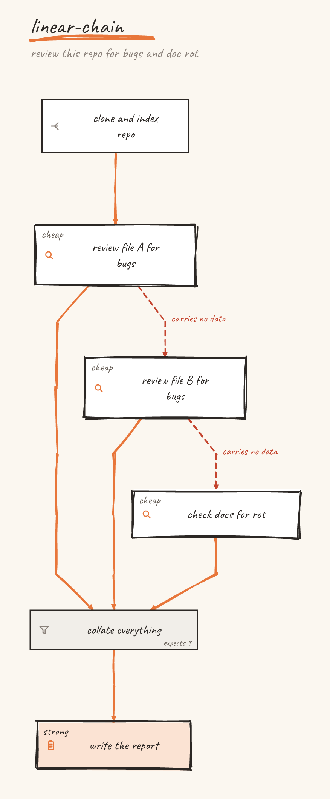
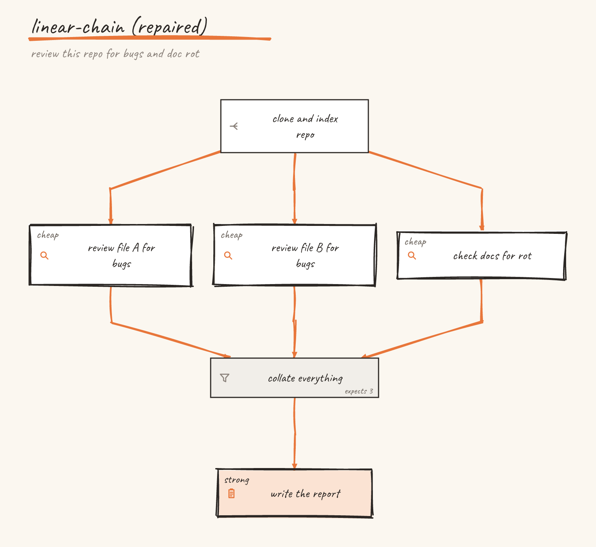
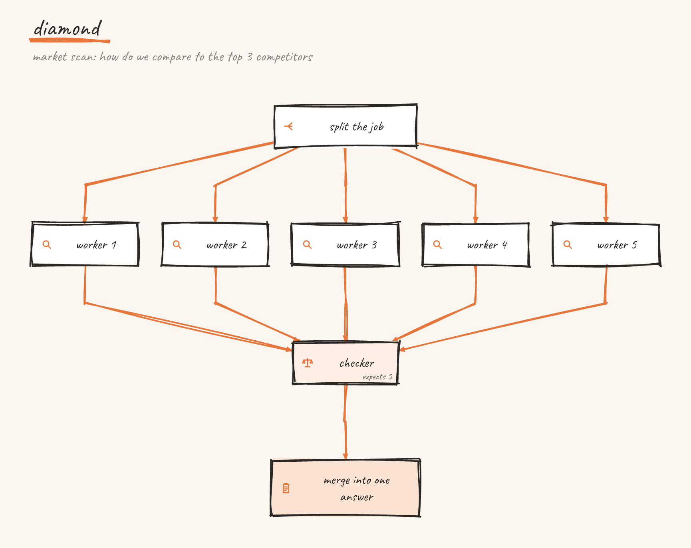
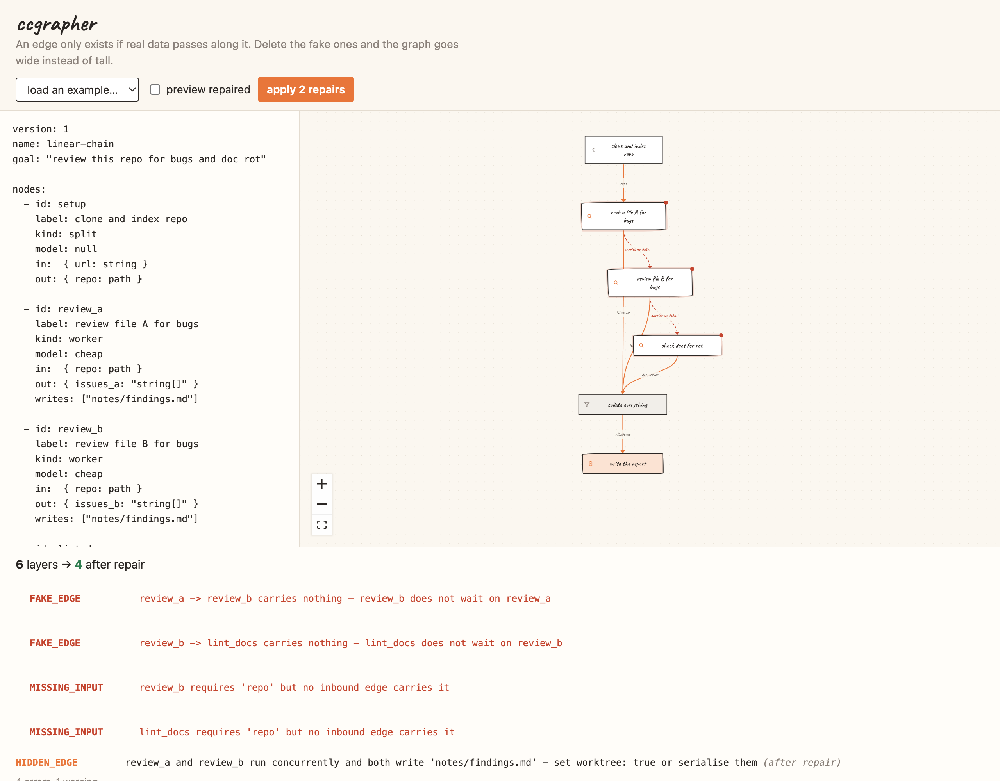
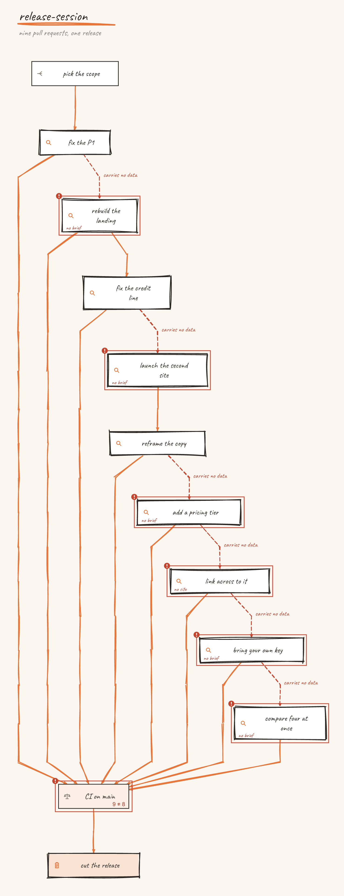
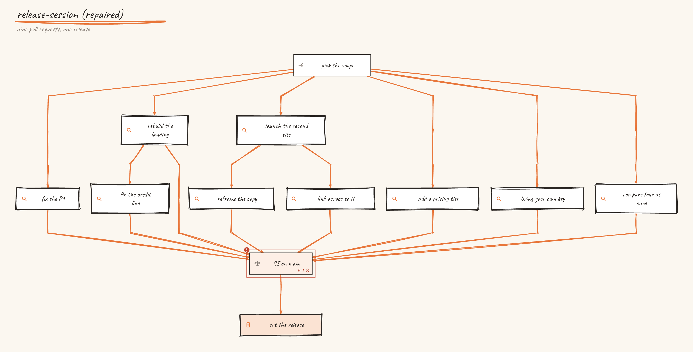

# ccgrapher

[](https://github.com/artfusion/ccgrapher/actions/workflows/ci.yml)
[](LICENSE)

**Your verification step is not checking what you think it is checking.** ccgrapher lints agent
workflows for the joins that pass while a branch lies dead and the verifiers grading their own
work. It also finds every step that was never waiting, and runs those together.

---

## Start here: the Claude Code skill

If you use Claude Code, this is the whole product in one command:

```bash
git clone https://github.com/artfusion/ccgrapher.git
ln -s "$PWD/ccgrapher/plugin/skills/parallel-plan" ~/.claude/skills/parallel-plan
```

Now, before your agent executes a plan of five steps or more, it checks which of them actually
depend on each other — and runs the independent ones concurrently instead of marching down the
list.

```
  wave 1               scope
  wave 2  ×6 together  fix_auth, rebuild_landing, new_site, pricing, byok, compare
  wave 3  ×3 together  add_tests, reframe_copy, cross_links
  wave 4               review
  wave 5               release
```

That's a real session: nine pull requests that were shipped one after another. Six of them were
never waiting on anything. Same work, five waves instead of twelve.

The speed is the bonus. The reason to run it is the failures it catches: a step that grades its
own work, or a fan-in that reports success when one branch silently died.

**Why it works:** you have to declare what each step *reads*, not what happened before it. Writing
that down honestly is what exposes the steps that were never waiting. Everything below is the
machinery that checks the claim.

---

## The idea

An edge between two agent nodes only exists if **real data passes along it**. Most workflows get
typed as a straight chain out of habit, because that's the order the steps occurred to you — so most
edges are fake. Delete them and the graph goes wide instead of tall: the same work now finishes in
the time of the slowest layer instead of the sum of every step.

Here is the same six-node workflow before and after. Nothing was rewritten; two edges that carried
no data were repointed to the node that actually supplies what the reviewers read.

| Written as a chain — 6 layers | What it actually is — 4 layers |
| --- | --- |
|  |  |

The three review steps never needed each other. The linter finds that mechanically, and the picture
is just how you see it. The after picture also shows what the chain was hiding: two of the reviewers
now run side by side and both write `notes/findings.md`.

## Quickstart

```bash
npx @ccgrapher/cli lint your-workflow.yaml
```

Nothing to install. Or from source:

```bash
git clone https://github.com/artfusion/ccgrapher.git
cd ccgrapher && pnpm install && pnpm build
node apps/cli/dist/index.js lint examples/linear-chain.yaml
```

```
linear-chain — review this repo for bugs and doc rot

  error  FAKE_EDGE      review_a -> review_b carries nothing — review_b does not wait on review_a
  error  FAKE_EDGE      review_b -> lint_docs carries nothing — lint_docs does not wait on review_b
  error  MISSING_INPUT  review_b requires 'repo' but no inbound edge carries it
  error  MISSING_INPUT  lint_docs requires 'repo' but no inbound edge carries it
   warn  HIDDEN_EDGE    review_a and review_b run concurrently and both write 'notes/findings.md'
                        — set worktree: true or serialise them (after repair)

  Proposed repairs
    repoint  review_a -> review_b becomes setup -> review_b, carrying 'repo'
      setup is the nearest node that supplies 'repo'
    repoint  review_b -> lint_docs becomes setup -> lint_docs, carrying 'repo'
      setup is the nearest node that supplies 'repo'

  Critical path: 6 layers -> 4 layers (2 fewer after repair)
  5 findings (4 errors, 1 warning)
```

Exit code is `0` when clean, `1` when there are errors, `2` on bad usage.

---

## Writing a spec

A spec is YAML. Two required lists — `nodes` and `edges` — plus a name and an optional goal.

```yaml
version: 1
name: market-scan
goal: "how do we compare to the top 3 competitors"   # a caption, never a node

nodes:
  - id: split
    label: split the job
    kind: split
    in:  { question: string }
    out: { angle: string }

  - id: worker_1
    label: worker 1
    kind: worker
    model: cheap
    in:  { angle: string }
    out: { claim: string, source: url }

edges:
  - { from: split, to: worker_1, carries: [angle] }
```

### Nodes

| Field | Type | Meaning |
| --- | --- | --- |
| `id` | string, **required** | Unique. Used in edges and in generated code. |
| `label` | string, **required** | What's drawn in the box. One to four words. |
| `kind` | enum, **required** | See below. Drives the shape and the icon. |
| `in` | map | Field name → type descriptor. What this node consumes. |
| `out` | map | Field name → type descriptor. What it produces. |
| `model` | `cheap` \| `strong` \| `null` | `null` means plain code — no model, no tokens. |
| `writes` | string[] | Files or APIs it touches. Two concurrent writers is a hidden edge. |
| `uses` | string[] | Capabilities it depends on — `mcp:server/tool`, `skill:name`, `plugin:name`, `agent:type`. Audited against what a run reports. |
| `effects` | string[] | What it does to the world that a later step cannot take back, such as `post:brief-channel`. See [Schedules, stores and effects](#schedules-stores-and-effects). |
| `guards` | string[] | Effects it makes at-most-once, by checking first or by holding an idempotency key. Each must be an effect some node declares. |
| `freshContext` | boolean | Set on a verifier. A worker must never grade its own work. |
| `expects` | number | Fan-in guard. How many results should arrive. |
| `fanOut` | `{ over, cap? }` | Run once per item. Stays one node, drawn as a stack badged `×N`. |
| `worktree` | boolean | Isolated space per run, so parallel workers can't collide on disk. |
| `priority` | `urgent` \| `high` \| `normal` | Which ready step gets the next free slot. Never a dependency. See [Urgency](#urgency). |
| `prioritySetBy` | string, one line | Who asked for the priority: a role, a team, a rota. Shown wherever the priority is. |

**Kinds.** `split` fans work out · `worker` does a unit of it · `verifier` checks someone else's ·
`reduce` combines (usually plain code) · `synthesize` writes the final answer · `gate` is a human
approval · `goal` is available for an explicit goal node, though the top-level `goal:` string is a
caption and is never turned into one.

**Type descriptors** are free text — `string`, `url`, `path`, `markdown`, `boolean`, `string[]`,
`YYYY-MM-DD`, `keep|drop`. The linter only compares field *names*, but codegen turns descriptors
into real JSON Schema and TypeScript types, so being specific pays off.

### Edges

| Field | Meaning |
| --- | --- |
| `from`, `to` | Node ids. |
| `carries` | The field names that travel along this edge. **This is the whole game.** |

An edge is real when `carries` names fields that exist in the source's `out` **and** the target's
`in`. If nothing survives that intersection, the edge is a wait with nothing behind it — and that is
what `FAKE_EDGE` reports.

What no rule checks is the other direction: whether a step's outputs could be made from what it is
handed. Field names are free text, and a step that does real work renames things on the way
through (`dedupe` turns `claim`, `source` and `date` into a `finding`), so an output named in no
input is the normal case and proves nothing. Read each step's `out` against its `in` and ask where
the data comes from. In `research-desk`, `vote` once received only the three votes and claimed to
pass on the finding that survived them. Each edge it had was real, so nothing fired; the edge from
`dedupe` carrying `finding` was simply missing, and easy to miss, because the path through the
skeptics already ordered the two. A step that passes data on needs an edge from wherever that data
was made, even when another path already makes it wait.

### Boundaries

A boundary names a group of nodes that one constraint covers, so the constraint is said once rather
than repeated on every member or left out of the picture. It is optional and sits beside `nodes` and
`edges`.

```yaml
boundaries:
  - id: gather
    label: gather and check
    members: [research, dedupe, skeptic_correct, skeptic_current, skeptic_source, vote]
    access: read-only
```

| Field | Type | Meaning |
| --- | --- | --- |
| `id` | string, **required** | Unique among boundaries. No commas or whitespace. |
| `label` | string | A short caption drawn on the region. |
| `members` | string[], **required** | Node ids. A node belongs to at most one boundary. |
| `access` | `read-only` \| `read-write` | What the members may do. `read-only` means no member writes anything. Defaults to `read-write`, which claims nothing. |

A boundary is drawn as a dashed region behind its members and never becomes a node. It changes no
rank and moves no box; the region is drawn around wherever the layout put the members. When those
members do not sit side by side, a single rectangle would also enclose nodes that are not in the
boundary, so the region is drawn in pieces instead, one around each run of adjacent members, each
carrying the caption. Mermaid draws a subgraph and keeps the members together by moving the others
aside within their row. Nesting and overlapping boundaries are not supported, and a spec that puts a
node in two boundaries is rejected.

Like `uses`, a boundary is a claim. `read-only` is checked against each member's `writes` and
`effects`, and a member with either is an `AUTHORITY_BREACH`; it cannot be checked against what a
tool in `uses` does, since a capability id says nothing about that. Limits such as a spend cap are
expected to attach to a boundary later. Generated plain-ts code carries boundaries in its header
and `ccg ingest` reads them back; the other targets say in a warning that they cannot.

### Schedules, stores and effects

Some workflows run again tomorrow, and what goes wrong with them goes wrong between runs: a post
made twice, a bookmark moved on before the post it marks, the agent rewriting preferences a person
keeps. None of that is in the dataflow, so the spec has three optional fields for it.

```yaml
schedule: "0 7 * * *"
stores:
  preferences: { owner: human }
  ledger:      { owner: agent, records: "post:brief-channel" }
```

| Field | Type | Meaning |
| --- | --- | --- |
| `schedule` | string, one line | When the workflow runs on its own: a cron line or words, read by nothing. What counts is that it is there, since a scheduled run is fired again and retried. |
| `stores` | map | State that outlives a run, keyed by id (no commas or whitespace). A node writes a store by naming it in `writes`. |
| `stores.<id>.owner` | `human` \| `agent`, **required** | Who writes it. A gate is the only human actor in a spec, so a store a person owns may be written by a gate and by nothing else. |
| `stores.<id>.records` | effect id | Marks progress state: the store says this effect has happened, so it may only be written after it. Left off, the store may be written whenever, which is how a design that claims before it acts says so. |

On a node, `effects` names what it does that cannot be taken back, and `guards` names the effects
it makes at-most-once, whether by looking at the destination first or by holding an idempotency
key. An effect id is opaque, `<verb>:<target>` by convention, with no commas or whitespace. Every
`guards` entry and every `records` must name an effect some node declares, or the spec is rejected
when it loads.

[`examples/daily-brief.yaml`](examples/daily-brief.yaml) uses all of them and lints clean. Three
rules read them, `AUTHORITY_BREACH`, `DUPLICATE_EFFECT` and `EARLY_COMMIT`, and none of the three
repairs anything: each fix would add a node, an edge or a field, and `--fix` only moves edges.

Generated plain-ts code carries the schedule and the stores in its header and the node fields in
each doc comment, and `ccg ingest` reads them back; the other targets say in a warning that they
cannot. A CLI older than these fields ignores them without a word, so on an old install a spec
that uses them lints clean whatever it declares.

### Urgency

A step can be marked urgent, and the graph still has to tell the truth about it.

```yaml
- id: patch
  label: patch the hole
  kind: worker
  priority: urgent
  prioritySetBy: on-call
```

Urgency changes the order of work that is ready, and nothing else. An urgent step still waits for
its inputs, it never stops a step that is already running, and it moves no node: the waves, the
ranks and every lint rule read the graph as they would without it. What it does do is pass
upstream. Every step the urgent one waits on, directly or not, inherits its priority while it has
not started, so the urgent step is not left queuing behind the very work it needs. `high` sits
between `urgent` and `normal`, and `normal` is the same as leaving the field out.

In the picture the waves stay where they were. The urgent step carries a small mark on its top right
corner, two chevrons for `urgent` and one for `high`, and the steps it pulls forward sit on a pale
blue wash, so the chain from the top of the graph to the marked step reads as one path. Hover over
any of them for who set it, or which step needs it. Mermaid and Excalidraw say the same in the
label: `urgent, set by on-call` on the step, `urgent, needed by patch` above it.

Generated plain-ts code carries both fields in its doc comments and `ccg ingest` reads them back.
The claude-code, langgraph and managed-agents targets say in a warning that they do not, since the
code they generate has no queue of ready work to reorder.

### Layers

You never declare layers. A node sits one row below its deepest dependency, so any two nodes with no
dependency between them land on the same row automatically. The diamond shape falls out of this:



---

## The eleven lint rules

| Rule | Severity | Fires when |
| --- | --- | --- |
| `FAKE_EDGE` | error | No carried field lands in the target's declared `in`. |
| `MISSING_INPUT` | error | A non-root node declares an input nothing supplies. |
| `AUTHORITY_BREACH` | error | A node that is not a gate writes a store a person owns, or a member of a `read-only` boundary has `writes` or `effects`. |
| `HIDDEN_EDGE` | warn | Two concurrent nodes share a `writes` entry and neither is isolated. |
| `SELF_GRADING` | warn | A `verifier` is not marked `freshContext`. |
| `MONOCULTURE` | warn | A `verifier` checks work done on its own tier, or by the same declared `agent:` in `uses`. |
| `CONTEXT_COLLAPSE` | warn | More than 30 results arrive with no intermediate `reduce`. |
| `SILENT_FAILURE` | warn | A real fan-in has no `expects` guard, or the guard is wrong. |
| `DUPLICATE_EFFECT` | warn | A scheduled workflow performs an effect that neither the node nor any step before it `guards`. |
| `EARLY_COMMIT` | warn | A node writes a store that `records` an effect without coming strictly after every node that performs it. |
| `TIER_MISMATCH` | warn | A fanned-out worker is `strong`, or the first `synthesize` step below a fan-out is `cheap`. |

Three things about this that aren't obvious:

**Lint runs twice.** Some problems are invisible in the graph as written. In `linear-chain` the two
reviewers both write `notes/findings.md`, but one is a rank behind the other, so they never look
concurrent. Only once the fake edges are repaired do they land on the same row and the collision
become real. Findings therefore carry `phase: "raw" | "repaired"`.

**Repairs repoint, they don't delete.** Deleting a fake edge leaves its target as a root that starts
before its real dependency has produced anything. So the proposal is always "repoint to the nearest
ancestor that supplies the missing field", and only when nothing upstream can supply it is the edge
dropped.

**Who does the work is checked, not only drawn.** A spec names a tier and never a model id, and a
target turns each tier into one model, so two steps on one tier run on one model. A verifier on
the same tier as the work it checks shares its blind spots, fresh context or not, and
`MONOCULTURE` says so; a shared `agent:` counts whatever the tiers. "The work it checks" is what
reaches the verifier along edges that carry something, seen through plain-code steps, which
dedupe or concatenate without judging anything. A node with no tier never matches, since unknown
is not equal to anything, and plain code has no model to share. `TIER_MISMATCH` is advice rather
than a defect: many cheap readers and one strong step to put them together is the usual shape, and
a spec that turns it round may mean to. It is a warning, which leaves the exit code alone, so
there is no third level for it. Neither rule fires on any example except `self-grading`, whose
cheap verifier grades two cheap drafters.

**An edge that only says "after" is still a fake edge.** If the step that records a post waits on
the post by an edge that carries nothing, `--fix` drops the edge, and the repaired pass then reports
`EARLY_COMMIT`: that is what dropping it costs. The ordering becomes real when the step takes
something from the post, such as its id, which is how `daily-brief` says it.

---

## Rendering

```bash
ccg render examples/diamond.yaml -o diagram.svg          # hand-drawn SVG
ccg render examples/diamond.yaml -o diagram.html         # same picture, pan and zoom
ccg render examples/diamond.yaml -o diagram.mmd          # Mermaid
ccg render examples/diamond.yaml -o diagram.excalidraw   # Excalidraw scene
ccg render examples/linear-chain.yaml --fix -o after.svg # draw the repaired graph
ccg render examples/linear-chain.yaml --pair -o chain.svg   # chain-before.svg and chain-after.svg
ccg render --pair draft.yaml revised.yaml -o plan.svg       # plan-before.svg and plan-after.svg
ccg render examples/diamond.yaml --legend -o diagram.svg    # numbered steps, listed underneath
```

The format comes from the extension, or pass `-f svg|html|mermaid|excalidraw`.

A change to a spec should be shown as a before and an after, so `--pair` writes both. With one spec
it draws the graph as written and then repaired. With two it draws each as written, which is how a
hand revision shows up: `--fix` moves edges, it never adds an `expects` guard, so adding one is a
change you pair by hand. `--pair` needs `-o` and cannot be combined with `--fix`.

The pair shows the shape; it does not say what moved. `ccg diff` does, in words, from the same one
or two specs:

```bash
ccg diff examples/release-session.yaml          # as written against its repair
ccg diff draft.yaml revised.yaml                # two specs, before then after
ccg diff draft.yaml revised.yaml --json         # the same change list, as data
ccg render --pair draft.yaml revised.yaml --ledger -o plan.html   # plus plan-ledger.html
```

```text
release-session
  12 to 5 waves, widest wave 1 to 6 steps
  12 steps, 18 edges
6 edges repointed
  pr_hotfix -> pr_landing becomes scope -> pr_landing, carrying brief
  ...
10 steps moved
  ...
  ci from wave 11 to wave 4 (7 waves earlier)
  release from wave 12 to wave 5 (7 waves earlier)
12 findings resolved
  FAKE_EDGE pr_hotfix -> pr_landing
  ...
```

The ledger lists steps added and removed, edges added, removed, repointed (an edge into the same
step that now comes from elsewhere, which is what `--fix` does) or carrying something else, count
guards added, removed or changed, any other declaration of a step that changed (its kind, tier,
`in`, `out`, `writes`, `uses`, priority, boundary and the rest), the wave each step moved from and
to, and the lint findings each spec has as written that the other does not. Steps are matched by
id, so a renamed step reads as one removed and one added. Two specs that say the same thing give
"no changes". It is worked out from the specs, never written by hand, and the same pair always
gives the same ledger.

`--ledger` with `--pair` writes it beside the pictures, never into them: for HTML a third page,
`-ledger.html`, with the before, the changes and the after side by side (stacked on a narrow
screen); for every other format a text file, `-ledger.txt`. `ccg diff` exits 0 whatever it finds;
`ccg lint` says whether either spec is sound.

Every node that declares `expects` carries the count, bottom right. Every lint rule has a mark,
so the picture is the lint report:

| Rule | Mark |
|---|---|
| `FAKE_EDGE` | the edge drawn red and dashed, "carries no data" |
| `MISSING_INPUT` | a solid red ring and flag on the node, captioned with the field: `no repo` |
| `HIDDEN_EDGE` | both writers ringed and joined by a thin solid red line, labelled with the file |
| `SELF_GRADING` | the verifier ringed, "grades own work" |
| `MONOCULTURE` | the verifier ringed, with what it shares: `same agent: reviewer`, or `cheap checks cheap` |
| `CONTEXT_COLLAPSE` | the overloaded node ringed, with the count: `200 in, no reduce` |
| `SILENT_FAILURE` | the fan-in ringed, "no count guard", or `9 ≠ 8` when the guard disagrees |
| `AUTHORITY_BREACH` | the writer ringed, with the store, `writes preferences`, or "writes in read-only" |
| `DUPLICATE_EFFECT` | the step performing the effect ringed, with the effect: `unguarded post:brief-channel` |
| `EARLY_COMMIT` | the early writer ringed, with the store, `ledger too early`, or `2 stores too early` |
| `TIER_MISMATCH` | the step ringed, with the tier the wrong way round: `strong per item`, or `cheap synthesis` |

A node has room for one caption, so a node with several findings names the first in rule order
and counts the rest: `no rubric +2`. Dashes are kept for structure (a human gate, an isolated
worktree, a dead edge), so a finding is never a new dash. Mermaid and Excalidraw carry the same
findings as a red outline and a note in the label; Excalidraw draws the shared-write line too,
while Mermaid notes it on both nodes, since any link there would move a node down a row.
`--plain` leaves every finding off; the counts stay, since they are declarations.

Each node also says who does the work. The model tier sits top left, `strong` in ink and `cheap`
a shade lighter; plain code (`model: null`) carries none, since its sharp corners already say it
costs nothing, and neither does a node with no tier. A node that declares `uses: [agent:reviewer]`
carries `agent: reviewer` as a quieter line under its label. The box grows to fit both, sized by
the layout from the declaration. Mermaid and Excalidraw add the same words to the label. The spec
names a tier, never a model id: a target such as `claude-code` resolves it, so a spec does not go
stale when model names change.

`--legend` numbers the steps in the order they run and lists them under the picture. The number is
the wave, which is also the row its box is drawn on, so steps that share one share a number and take
a letter each in spec order: `2a` to `2e` for the diamond's five workers, which says what can run
together. A fanned-out step is listed
once, with what it fans over and its cap. Each line gives the step's label and what it takes and
gives, read from the field names in its `in` and `out` and shortened past three, so the legend is
derived from the spec and cannot drift from the picture. In the SVG the number sits in a small
pill outside its box, at the first clear place in a fixed order (over the box's left end, then up
and to its left, then beside it), since the box's corners are spoken for. Boxes and edges do not
move for it, and the canvas grows to hold the list. In HTML the numbers are on the picture and the
list is an HTML list beside it, under it on a narrow screen. Mermaid puts the number at the front
of each label and the list in a comment block; Excalidraw puts it at the front of each label, so it
moves with the box, and the list in one text element underneath. With `--pair`, each picture has
its own legend, so the numbering changes where the waves do. Off by default.

- **SVG** — rough.js strokes, paper texture, the handwriting face embedded so the file renders
  identically anywhere. Fake edges are red and dashed with a "carries no data" label.
  `--no-grain` drops the paper texture (much smaller once rasterised); `--no-embed-font` references
  the typeface by name instead of inlining it.
- **HTML** — the same SVG wrapped in one self-contained page: wheel zoom anchored at the cursor,
  drag to pan, a fit button. No CDN, no network requests, so it opens and reads fine as a chat
  attachment or a browser tab — reach for this over plain SVG whenever the graph is bigger than a
  handful of nodes and the labels need to be legible up close.
- **Mermaid** — `flowchart TD` with `look: handDrawn`. Renders on GitHub and in Notion. Each kind
  gets a distinguishable shape, and edges are labelled with what they carry.
- **Excalidraw** — a scene you can open and nudge by hand: drag the `.excalidraw` file onto
  [excalidraw.com](https://excalidraw.com), or open it with the Excalidraw extension in VS Code.
  Arrows are bound to their boxes and labels live inside their containers, so dragging a node takes
  everything with it. Edits made there are not written back to the spec — it is a picture to hand
  someone, not a second source of truth.

Every renderer is deterministic: same spec in, byte-identical output out.

## Generating orchestration code

```bash
ccg codegen examples/diamond.yaml -t claude-code   # agent() / parallel()
ccg codegen examples/diamond.yaml -t plain-ts      # typed functions + Promise.all
ccg codegen examples/diamond.yaml -t langgraph     # StateGraph wiring
```

Stages come straight from the graph's ranks, so the concurrency in the generated script is exactly
the concurrency the diagram shows — the two cannot drift.

```js
phase("Workers")
const [worker_1, worker_2, worker_3, worker_4, worker_5] = await parallel([
  () => agent(`worker 1. Return claim (string), source (url), date (YYYY-MM-DD).
…`, { label: "worker_1", schema: WORKER_1_SCHEMA, model: "haiku" }),
  …
])

phase("Checker")
const checkerInputs = [worker_1, worker_2, worker_3, worker_4, worker_5].filter(Boolean)
if (checkerInputs.length < 5) {
  log(`checker: expected at least 5 results, got ${checkerInputs.length}`)
}
// checker runs in a fresh context — it must not share one with the work it grades
const checker = await agent(…)
```

`fanOut` becomes a capped `parallel` map, `worktree` becomes `isolation: "worktree"`, and `expects`
becomes a guard on the results that *arrived* — because a dead upstream node otherwise slips through
and the synthesis step reports on partial data as though it were whole.

The generated guard is a floor rather than an equality: at run time a shortfall is the failure, and a
count that overshoots means the guard is stale rather than that anything is missing. `SILENT_FAILURE`
is the stricter of the two, and polices the exact count at spec time, where it can still be fixed.

Pass `--fix` to generate from the repaired graph. Generating from a spec with known fake edges bakes
the wasted waits into your runtime, so the CLI warns when you do.

### Claude Managed Agents

```bash
ccg codegen examples/research-desk.yaml -t managed-agents -o out/
```

This target writes a directory rather than a file: the layout `ant apply` reads. Each model node
becomes one agent in `agents/<node>/agent.md` (the folder in kebab-case), named by its node id, with its tier resolved to a full
model id (`strong` to `claude-opus-5-5`, `cheap` to `claude-haiku-5-5`) and a system prompt built from
its label, kind, fields and writes. A node with no tier gets the strong model, and a warning. Plain-code
nodes and gates get no agent, since the runner runs those itself, and the generated `README.md` lists
them. One `environment.yaml` covers the workflow, a `cloud` container with limited networking.

There is no coordinator agent. The files are meant for a runner that opens one session per node in
the order the spec declares, so the order is kept by code rather than by a prompt. `ccg run
--managed-agents` is that runner; see [Running on Claude Managed Agents](#running-on-claude-managed-agents).

`uses:` maps where the platform has an equivalent. A skill becomes a skill reference and an agent a
roster entry, though a custom skill, or an agent from outside the spec, needs an id the spec does not
have. An MCP server needs a URL it does not have either. Each of those is written as a `YOUR_`
placeholder with a warning, and MCP tools are left at `always_ask`. A plugin has no equivalent and is
only warned about. Search for `YOUR_` before applying anything.

`-o` is required, and the directory must be empty unless you pass `--force`, which replaces the
generated files and leaves everything else alone. Apply by naming the generated files, as the
generated README shows. `ant apply .` walks the whole tree, and in a repository that holds other
skills it would upload those as well.

## Explaining a spec

```bash
ccg explain examples/research-desk.yaml -o desk.html
```

One page that sets a spec out for someone who has not read it, in three panels. The full loop is
the picture `ccg render` draws, with its boundaries, marks and numbered steps, and it pans and zooms
as the HTML render does. One run, step by step is the numbered list from `--legend`, so a number on
the picture can be found in the list. What it is made of lists the files `ccg codegen` would write
for the target, `claude-code` unless `-t` says otherwise (`managed-agents` shows its directory as a
tree), each with a line on what it is for, and then the lint findings, grouped by rule. With
`--fix` the page describes the repaired graph, and when the repair changes anything, the spec as
written and as repaired sit side by side.

Every word on the page comes from the spec, the linter or the code generator. None of it is written
by a model, and the same spec gives the same bytes. The page is one file, with the handwriting face
inline and nothing fetched, so it reads offline; it follows the reader's light or dark setting, and
the panels stack on a narrow screen.

## Reading existing code

The other direction — what does my workflow *actually* do, rather than what did I intend?

```bash
ccg ingest orchestration.ts            # reconstruct the spec
ccg ingest orchestration.ts --lint     # audit the code directly
```

`ingest` uses ts-morph to recover nodes, dependencies and concurrency from real TypeScript. This is
where the fake-edge audit finds waste that was never in anyone's diagram.

Round-tripping is lossless: `spec → codegen → ingest → spec` returns a deeply-equal spec for every
fixture, which the test suite asserts. Descriptors TypeScript would flatten to `string` (`url`,
`path`, `YYYY-MM-DD`) ride along in trailing comments, and everything the type system can't express
— kind, model tier, fresh context, worktree, guards, declared capabilities — lives in the doc
comment above each function. Both read as ordinary documentation.

## Retrospective mode

History is a workflow too. `retro` rebuilds the graph of a repo's last N merged pull requests —
nobody writes a line of YAML:

```bash
ccg retro owner/repo --lint            # audit the as-merged history directly
ccg retro owner/repo -o history.yaml   # or keep the spec for render / plan
```

One node per PR, labelled with its ticket IDs, `writes:` filled from the changed files. The
merge-order chain is the claim under audit: an edge carries data only where there is *evidence* of
coupling — two PRs touched the same file. Everything the repair pass then drops had **no detectable
dependency**, which is a smaller claim than *independent*, and the one the data supports.

Rendered before and after, a fortnight of sequential merges usually collapses from a staircase to a
few short chains — the same picture `examples/release-session.yaml` draws by hand, recovered from
any repo automatically. Requires the [GitHub CLI](https://cli.github.com) (`gh`) and whatever access
to the repo your `gh auth` already has; `--from-json` replays a saved `gh pr list` dump instead, for
offline runs and tests.

## Running a spec

The spec is not only a picture. `ccg run` executes it and writes a trace of what actually happened:

```bash
ccg run examples/live-demo.yaml --impl examples/live-demo.impl.mjs
```

`--impl` is an ordinary JS module. Every node id in the spec needs an exported function of the same
name, and a node that has none is an error **before the run starts**, naming all of them at once.
Finding that out halfway through is the kind of failure this project exists to prevent. Gates are
the exception: a gate is answered by a human, never executed, so it needs no implementation.

A node is handed a `NodeContext` and returns `{ output?, usage? }`, or nothing. `context.inputs`
holds only the results that genuinely arrived, never padded and never holed, so a node can always
tell what reached it. `context.log(line)` writes a `node_log` event against that node, and
`context.capability(id)` writes a `capability_invoked` one, which is how a node says it actually
reached for the thing its `uses:` declared.

The module may also `export const capabilities = [...]`: the ids it verified were reachable before
the run, written out as one `capability_available` each. Leaving it out is fine and means nobody
looked, which is not the same claim as looking and finding nothing — so a run that says nothing
about a capability is never read as reporting its absence.

The trace lands in `runs/<run-id>.jsonl`, or wherever `--trace` says. The run id and the filename
are the same fact, which is what lets `ccg serve` stream a file and the fold key on it. A run never
appends to a trace that already exists: two runs in one file would number two sequences from zero,
and a trace is a record rather than something to write over.

```bash
ccg run spec.yaml --impl impl.mjs --serve         # a canvas can watch, and answer gates over HTTP
ccg run spec.yaml --impl impl.mjs --timeout 300   # give up on any one node after five minutes
ccg run spec.yaml --impl impl.mjs --concurrency 3 # at most three node calls at once
```

**When a step starts.** A step starts as soon as every step it has an edge from has finished and
delivered, and its `expects` guard is met. It does not wait for the rest of its wave. The waves
`ccg plan` prints say what *may* run together; they are not a barrier, so one slow step holds up
only the steps that need its output. Without `--concurrency` there is no limit, and everything
ready starts at once. With it, each node call takes a slot (a fanned node takes one per instance;
a gate waiting on a human and a skipped node take none), and when more is ready than there are
slots, the lower rank goes first, then the order of the spec. That order is also how steps that
become ready together are started, so a run's trace comes out the same each time. A node's
timeout runs from the moment it gets its slot, not from when it became ready.

**Urgency.** A step's [`priority`](#urgency) comes before rank in that order: urgent, then high,
then the rest. Each step an urgent one waits on carries the same priority, so with one slot free
and three steps ready, the one the urgent step needs goes first, however late it comes in the
spec. A running step is never interrupted to make room, and a step is never started before its
inputs exist. So urgency only shows when `--concurrency` leaves more ready than there are slots;
without a limit, everything ready starts at once and only the order of the trace lines changes.
Each step that starts at a raised priority says so in its `node_started` event, with the step it
inherited from and who set it, so a run can be read afterwards for why work moved. A spec with no
priority runs, and writes its trace, exactly as before.

**When a step fails.** Its descendants are skipped, each with a `node_failed` that names the input
that never arrived, and they are skipped the moment the failure is known. Branches that do not
depend on it carry on to the end. An unmet `expects` guard, or a gate nobody can answer, stops the
run: nothing new starts, what is already running is allowed to finish and is recorded, and then
the run ends.

**Gates.** With `--serve` the run embeds the trace server in its own process and a gate waits for a
`POST /runs/<id>/gates/<node>`. Without it, the run asks on the terminal. If neither is possible,
no terminal and no server, the run refuses to start rather than approving the gate for you. An
unattended gate that approves itself is exactly the lie the rest of this tool exists to find.

Exit codes are `0` for a run where everything completed, `1` for one that failed, `2` for bad usage
or an implementation that does not cover the spec, and `3` for a run stopped at a rejected gate.
The rejection has its own code because the engine already distinguishes it from a failure: a script
needs to be able to tell "the workflow broke" from "a human said no".

`examples/traces/live-demo.jsonl` is the trace the demo above produces, committed so the canvas has
a sample run to develop against. `ccg trace stats` summarises it; `ccg serve examples/traces`
replays it.

### Running on Claude Managed Agents

The model steps can run as Claude Managed Agents sessions instead of local functions. Generate the
agent files, apply them by name from the generated directory so `claude-lock.json` is written
there, and point the run at it:

```bash
ccg codegen examples/research-desk.yaml -t managed-agents -o desk/
# in desk/: grep -rn YOUR_ agents/, then ant apply the files its README lists
ANTHROPIC_API_KEY=... ccg run examples/research-desk.yaml --managed-agents desk --impl local.mjs
```

Each model node opens one session for its agent, and each copy of a fanned node opens one more. The
plain-code steps still come from `--impl`, and the runner still keeps the order, the `expects`
guards and the gates, and writes the trace itself, so `ccg trace audit` reads it like any other run.
The session's first message is the node's inputs as a JSON envelope; its last reply must be a JSON
object holding the node's declared outputs, and a reply that is not fails the node and says why. On
`--timeout` the session is interrupted and the node fails. Sessions are archived when done, never
deleted, and each carries the run id, spec and node in its metadata.

It costs real money, so it is worth being plain about how much. One session per node is not one
session per run: research-desk opens ten, each a container billed for its running time as well as
its tokens, and the run says how many it will open, and on which account, before the first one
starts. `--session-budget <usd>` puts a hard cap on each session. The run needs `ANTHROPIC_API_KEY`
or `ANTHROPIC_AUTH_TOKEN` in its environment and exits 2 without one; a saved `ant` profile alone is
deliberately not enough.

Apply the generated files by name. `ant apply .` walks the whole tree, and in a repository that holds
other skills it would upload those as well. The details, including the message protocol, are in
[`packages/runner-managed-agents`](packages/runner-managed-agents).

## Auditing capability use

A spec says which capabilities a node depends on. A trace says which the runtime had, which it
lost, and which something actually reached for. `ccg trace audit` holds the two against each other:

```bash
ccg trace audit runs/my-run.jsonl --spec spec.yaml
ccg trace audit runs --spec spec.yaml --json     # a whole directory, pooled
```

| Finding | What it means |
| --- | --- |
| `CAPABILITY_GAP` | A node ran while something it declares was reported gone. An error. |
| `UNUSED_CAPABILITY` | A node ran and never reached for something it declares. |
| `UNDECLARED_CAPABILITY` | A node used something it does not declare. Or, when the run named no node, something no node in the spec declares. |
| `ORDER_VIOLATION` | A node started before a declared predecessor finished. For a fanned predecessor, finished means every copy, not the first one back. An error. |
| `FAN_IN_SHORTFALL` | A node with `expects: N` started with fewer than N results recorded upstream, the same test `ccg run` applies before it lets the node start. A surplus is not reported here; the linter already calls it a stale count. An error. |
| `NODE_NEVER_RAN` | The spec declares a node and no audited run shows it ran. |
| `UNDECLARED_NODE` | A run started a node the spec does not declare. |
| `OBSERVED_SERIALISATION` | Two nodes with no declared path between them never overlapped across several runs, which suggests an edge nobody wrote down. |

Exit code is `0` when clean or only warnings, `1` when there is an error finding, `2` on bad usage,
matching `lint`. Bad usage includes handing it a trace and a spec that have nothing to do with each
other, on which more below.

These do not join the lint rules. An audit finding needs a run as well as
a spec, so a spec on its own can never produce one — which is why they live behind their own
command rather than inside the linter.

Two rules about silence hold throughout, and they are the point rather than a detail. A capability
nothing reported on is **unknown, never missing** — `CAPABILITY_GAP` needs positive evidence that
something went away. And `UNUSED_CAPABILITY` stays quiet unless the run reported at least one
invocation somewhere, because a producer that never reports them has not told you a declaration
went unused; it has told you nothing. A clean report over a silent trace says so in as many words,
and `--json` carries `reportedCapabilities` so a script can tell the two apart as well.

An audit is only honest about a run that came from the spec it is being held against. A run records
its spec's name, so a trace that names a different one is left out and reported as skipped, and a
file where *every* run names a different spec is bad usage rather than a report — two unrelated
workflows need only share a node name to appear to disagree, and that finding would be confident,
specific and fiction. A run that recorded no spec at all is audited anyway: it made no claim to
contradict, and refusing it would be the same error in the other direction. When the name matches
but the recorded hash does not, the spec has been edited since the run and the findings are
reported with that said.

Any producer can write these events. `ccg run` emits them natively, and
[`@ccgrapher/adapter-claude-code`](packages/adapter-claude-code) turns a Claude Code session into
the same trace through its hooks, so the tools an agent actually reached for become a run you can
read, serve and audit like any other.

## The web canvas

```bash
pnpm --filter @ccgrapher/web dev
```



Edit the YAML and the graph redraws and re-lints on every keystroke. **preview repaired** shows the
collapsed graph without touching your source; **apply repairs** rewrites it. It imports the same
`core`, `lint` and `layout` packages the CLI does, so the two can't disagree.

The canvas draws in the other direction too: drag a link from one port to another and the edge
lints as you draw, and the field it carries is written straight back into the YAML pane. Dragging a
*node*, on the other hand, does nothing to the spec — the picture is a consequence of the `in:`/
`out:` declarations, never something a human moved, so only a connection is a real edit.

**August 2026 — moved from React Flow to [JointJS](https://www.jointjs.com/).** The picture, the
overlays and the findings are unchanged; what's new is the port system above. Every node's declared
`in:`/`out:` fields are real, individually draggable ports now, not a single anonymous handle — so
connecting two of them is how an edge gets proposed, and the linter's read on it is immediate rather
than a save-and-reload away.

### The hopper

A plan in progress keeps collecting ideas. The hopper at the top of the canvas takes them as they
come, a line or a page, and works out where each one belongs.

```bash
export ANTHROPIC_API_KEY=...            # read by the server only; the browser never sees it
ccg serve runs --drafting               # adds POST /draft beside the trace routes
pnpm --filter @ccgrapher/web dev
```

Drafting runs in `ccg serve` on your own machine, which holds the key; the canvas posts to it and
never calls a model itself. The model is sent two things: the brain dump and the spec, as the canvas
holds it. A second call, in a fresh context, is sent the spec and the steps the first one drafted,
so the drafter is not the one checking its own work. Nothing else leaves the machine. Without
`--drafting` the route is a 404, and the hopper says how to turn it on; `--drafting` without
`ANTHROPIC_API_KEY` refuses to start. The default model is `claude-opus-5-5`, and `--draft-model`
or `CCG_DRAFT_MODEL` changes it. Each brain dump costs at most two model calls on that key.

What comes back is shown before anything moves:

- **new steps**, each with a label, a kind, a tier, honest `in` and `out`, what it writes, the words
  it came from, and what the check made of it;
- **already in the plan**, an idea that repeats a step the spec has, with the step it joins;
- **waiting on you**, questions and decisions, which are not work and do not become steps;
- **set aside**, everything else, each with its reason. A draft the spec schema refuses lands here
  with the schema's own reason.

A drafted step can be shown on the canvas as a ghost, opened in the inspector and corrected, then
accepted or rejected. Its edges are never drafted: they are read off its `in` and `out`, from the
steps that give what it takes and to a step that takes what it gives and has nothing supplying it.
Accepting checks it again against the spec and the run as they are at that moment, writes it as one
undoable edit, and the boxes travel to where it lands, with a sentence saying where and why:
"Placed in wave 3, after “Write the stylesheet”, which it reads css from." A rejected draft stays,
with its reason, until it is dismissed.

With a live run attached, a step that has started or finished is left exactly as it is. A draft may
read what such a step gives, but one that would give it a new input is refused, with the reason.

---

## More on the skill

`plugin/skills/parallel-plan/` triggers on plans of roughly five steps or more, or whenever work is being
fanned out to subagents. Below that the ceremony costs more than it saves, and a skill that fires
on everything gets ignored. `template.yaml` is the starting point it copies.

Two things worth knowing when reading its output:

- **Waves are an upper bound, not an instruction.** Six steps in one wave means six *may* run at
  once — rate limits, cost, or a shared file may say otherwise.
- **The layer count is only as honest as the `in:` fields.** Declare a dependency that isn't real
  and you get a chain back. The spec is the argument; the tool checks it for consistency.

## Architecture

| Package | Does |
| --- | --- |
| [`core`](packages/core) | Zod schema, YAML parsing, cycle detection, longest-path ranks |
| [`lint`](packages/lint) | The eleven rules and the two-pass repair pipeline |
| [`layout`](packages/layout) | dagre wrapper → positioned nodes and routed edges |
| [`render-svg`](packages/render-svg) | rough.js + paper texture + embedded font |
| [`render-mermaid`](packages/render-mermaid) | `flowchart TD` with `look: handDrawn` |
| [`render-excalidraw`](packages/render-excalidraw) | Scene JSON with bound arrows |
| [`codegen`](packages/codegen) | Spec → Claude Code / plain TS / LangGraph |
| [`ingest`](packages/ingest) | ts-morph: orchestration code → spec |
| [`trace`](packages/trace) | The event contract, the JSONL writer, and the fold every reader shares |
| [`runner`](packages/runner) | Walks the ranks, enforces the guards, emits the trace |
| [`runner-managed-agents`](packages/runner-managed-agents) | Runs each model step as a Claude Managed Agents session |
| [`adapter-claude-code`](packages/adapter-claude-code) | Claude Code hooks → a trace of a real session |
| [`apps/cli`](apps/cli) | `ccg lint · render · codegen · explain · ingest · run · serve` |
| [`apps/web`](apps/web) | Next.js + JointJS canvas |

**The one invariant.** `core` computes *ranks*; `layout` computes *pixels*. The "6 layers → 4" figure
in a lint report comes from `core` and never from the layout library, so the picture and the report
cannot silently disagree. dagre is handed core's ranks rather than ranking the graph itself (its own
`longest-path` ranker counts from the bottom and sinks a step towards whatever reads it), and a test
asserts that every step is drawn on the row of its wave in every spec in the repository.

`core`'s main entry is bundler-safe; filesystem helpers live at `@ccgrapher/core/node`. That's what
lets the browser canvas run the identical linter.

## Development

```bash
pnpm build          # tsc -b across the workspace
pnpm test           # 246 tests
pnpm test:watch
```

Node 22+. CI runs the suite on Node 22 and 24 and re-checks the acceptance criteria end to end.

Generated code is verified by parsing it, not by eyeballing: the TypeScript targets go through real
`ts.createProgram` diagnostics under `strict`, and the Claude Code target is parsed as an async
function body. Mermaid output is verified by rendering it — open `tools/mermaid-check.html` after
emitting some `.mmd` files. `tools/rasterize.mjs` regenerates the README images.

See [CONTRIBUTING.md](CONTRIBUTING.md) — adding a lint rule is four steps and the most useful thing
you could contribute.

### Examples

`diamond`, `research-desk` and `route-auth-audit` are clean — every edge carries real data, so they
double as the negative controls in the test suite. `linear-chain` is deliberately broken and is the
linter's fixture. `self-grading` and `wide-fanin` were added because nothing in the original drop
exercised `SELF_GRADING` or `CONTEXT_COLLAPSE`. `daily-brief` is clean and is the one that runs
on a schedule; its broken variants, one per rule about what one run hands the next, sit with the
linter's tests in `packages/lint/test/fixtures/daily-brief`; research-desk's, with the tiers moved
and an agent shared, sit in `packages/lint/test/fixtures/research-desk`. `live-demo` is the one that executes: it lints
clean, sleeps rather than calling a model, fails one node on purpose and stops at a human gate.

`release-session` is the one to read if you want to see why this is worth doing. It is not an agent
workflow at all — it is a week of human work: nine pull requests shipped one after another, then a
release. Six of the nine were never waiting on anything, and the CI node declares it expects nine
results while only eight edges reach it. A release that looks complete, built on a check that never
saw everything.

```bash
ccg lint examples/release-session.yaml
```

| As it ran — 12 layers | What it actually was — 5 layers |
| --- | --- |
|  |  |

## Provenance

The design came from a handoff document written while reading Anatoli Kopadze's article
["Graph Engineering explained"](https://x.com/anatolikopadze/status/2080668775796314331), which is
where the fake-edge test, the diamond pattern and the failure modes come from. That document is kept
verbatim as [HANDOFF.md](HANDOFF.md); the companion chat transcript is not published.

Reviewing the handoff against its own fixtures turned up nine defects — among them that
`HIDDEN_EDGE` could never fire under the rule as stated, that every fixture's entry node would
report a spurious `MISSING_INPUT`, and that one fixture's layer count was simply wrong. The
resolutions are the reason the linter behaves the way it does, and they're recorded in the git
history: the first commit is the drop exactly as delivered, the second is everything built on top.

The article's diagrams are referenced by URL and not vendored. Matching a hand-drawn-and-orange
aesthetic is fine; reproducing someone's illustrations is not.

## License

[Apache-2.0](LICENSE). See [NOTICE](NOTICE).

One thing worth knowing if you redistribute the output: `render-svg` embeds the
[Caveat](https://github.com/googlefonts/caveat) typeface (SIL OFL 1.1) into the SVGs it produces, so
every generated SVG carries the font's attribution inline. Render with `--no-embed-font` if you want
a file with no font data in it. Full details in [THIRD-PARTY-NOTICES.md](THIRD-PARTY-NOTICES.md).
